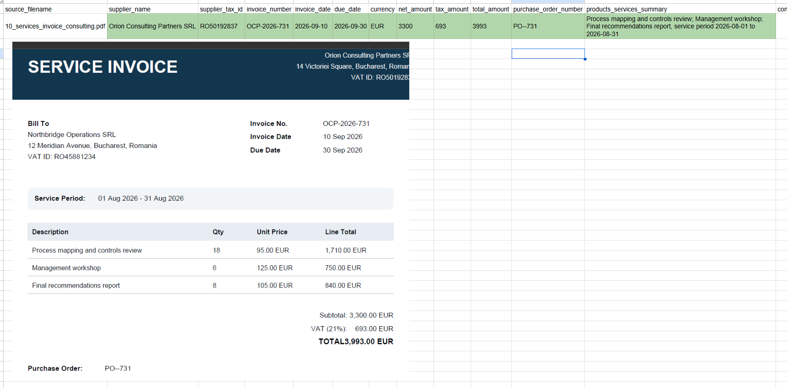

# AI Invoice Processor

AI Invoice Processor is a beginner-friendly local Streamlit application. It reads
digital and scanned PDF invoices, asks an OpenAI model to convert the extracted
text into structured fields, checks the values, lets a person correct them, and
exports the reviewed results.

## Version 2 features

- Runs locally with a Streamlit interface.
- Accepts one or more PDF invoices.
- Reads embedded text from digital PDFs.
- Automatically uses local Tesseract OCR when a PDF has insufficient embedded text.
- Supports English and Romanian OCR.
- Shows whether digital extraction or local OCR was used.
- Shows extracted text for human review before it is sent to AI.
- Requests typed, structured output from an OpenAI model.
- Extracts supplier, invoice, date, currency, amount and purchase-order fields.
- Summarises billed products and services in a separate column.
- Includes the service period when it is stated on the invoice.
- Checks required fields, dates, currencies and arithmetic.
- Lets a person edit extracted values before export.
- Supports batch processing with an individual result for each file.
- Downloads reviewed results as CSV or Excel.
- Includes automated tests that do not call OpenAI or perform real OCR.

## Screenshot



## Project structure

```text
invoice-processor/
├── app.py                         # Streamlit interface and review screen
├── src/invoice_processor/
│   ├── ai_extractor.py            # OpenAI structured extraction
│   ├── config.py                  # Environment and application settings
│   ├── exporters.py               # CSV and Excel creation
│   ├── models.py                  # Structured invoice data models
│   ├── ocr_extractor.py           # Local Tesseract OCR
│   ├── pdf_extractor.py           # Digital extraction with OCR fallback
│   ├── validation.py              # Explainable business checks
│   └── workflow.py                # Invoice-processing coordinator
├── tests/                         # Automated tests
├── docs/images/                   # Documentation screenshots
├── .env.example                   # Safe configuration example
├── requirements.txt               # Python dependencies
└── pyproject.toml                 # Package and test configuration
```

## Extracted invoice fields

```text
supplier_name
supplier_tax_id
invoice_number
invoice_date
due_date
currency
net_amount
tax_amount
total_amount
purchase_order_number
products_services_summary
confidence_notes
```

When an invoice does not contain a field, its value should be `null`. The
application does not ask the AI model to invent missing information.

`products_services_summary` contains a concise summary of billed products and
services. Multiple entries are separated with semicolons. A service period is
included beside the service name only when the invoice states one.

## Requirements

- Windows 10 or Windows 11
- Python 3.11 or newer
- Tesseract OCR 5
- English and Romanian Tesseract language data
- An OpenAI API key with API billing configured

Digital text extraction and OCR run locally. OpenAI API credit is only used after
the user confirms the text preview and continues with AI extraction.

## Install Tesseract OCR on Windows

Install Tesseract before installing the Python requirements. Windows installers
are available through the link provided in the
[official Tesseract installation documentation](https://tesseract-ocr.github.io/tessdoc/Installation.html).

The application expects the default installation folder:

```text
C:\Program Files\Tesseract-OCR
```

During installation, include:

- English language data (`eng`)
- Romanian language data (`ron`)
- Orientation and script detection (`osd`)

Verify the installation in PowerShell:

```powershell
& "C:\Program Files\Tesseract-OCR\tesseract.exe" --version
& "C:\Program Files\Tesseract-OCR\tesseract.exe" --list-langs
```

The language list should contain:

```text
eng
osd
ron
```

Tesseract consists of the OCR engine and separate trained language-data files.
Additional language files normally belong in:

```text
C:\Program Files\Tesseract-OCR\tessdata
```

If Tesseract uses a different location, set `TESSDATA_PREFIX` to the folder that
contains the `.traineddata` files.

## Python setup on Windows

Open PowerShell in the project folder and run:

```powershell
python -m venv .venv
.\.venv\Scripts\python.exe -m pip install --upgrade pip
.\.venv\Scripts\python.exe -m pip install -r requirements.txt
```

Create the local settings file:

```powershell
Copy-Item .env.example .env
```

Open `.env` and replace the example API key:

```dotenv
OPENAI_API_KEY=your_real_api_key
OPENAI_MODEL=gpt-4.1-mini
```

Never commit `.env` or a real API key to GitHub.

The model can also be changed in the application sidebar. Use a model available
to your OpenAI project that supports structured output.

## Run the application

```powershell
.\.venv\Scripts\python.exe -m streamlit run app.py
```

Open `http://localhost:8501` if the browser does not open automatically.

## Processing workflow

1. Upload one or more PDF invoices.
2. Select **Extract and preview text**.
3. The application first tries normal embedded-text extraction.
4. If almost no embedded text is found, it automatically runs local Tesseract OCR.
5. The application displays the reading method and extracted text.
6. Confirm that the important information is readable.
7. Select **Continue with AI extraction**.
8. Review the structured fields and validation messages.
9. Correct any inaccurate values manually.
10. Download the reviewed results as CSV or Excel.

The first extraction and preview stage is local and does not use OpenAI API
credit. Extracted text is sent to OpenAI only after the user selects
**Continue with AI extraction**.

## Run automated tests

```powershell
.\.venv\Scripts\python.exe -m pytest
```

The test suite uses simulated PDF pages, OCR responses and AI responses. It does
not process real invoices, run real OCR, contact OpenAI or consume API credit.

The current test suite contains 24 tests covering:

- AI-response handling
- Digital PDF extraction
- OCR fallback
- Multi-page OCR
- Missing OCR language data
- Empty or unreadable documents
- Invoice validation
- CSV and Excel exports
- Processing workflow

## Privacy and security

- Uploaded PDFs are processed in memory and are not intentionally saved by the
  application.
- Digital PDF extraction and Tesseract OCR run locally.
- After user confirmation, extracted invoice text is sent to the configured
  OpenAI model.
- The original PDF image is not sent to OpenAI by this application.
- API response storage is disabled in the request with `store=False`.
- Do not upload documents you are not permitted to process.
- Do not commit real invoices, customer data, downloaded exports, `.env`, API
  keys or the virtual environment to GitHub.
- Use only synthetic or properly anonymised invoices in public demonstrations,
  screenshots and repositories.
- Remove confidential source files and exported spreadsheets when they are no
  longer required.
- This prototype does not claim GDPR compliance. Real client use requires an
  appropriate legal, privacy and security review.
- AI extraction and OCR can both be inaccurate. Human review is required before
  relying on or exporting the results.

## Known limitations

- OCR is currently configured for English and Romanian.
- Low-resolution, blurred, rotated, handwritten or damaged documents may produce
  inaccurate OCR results.
- Complicated tables and unusual invoice layouts may be interpreted incorrectly.
- The product and service output is a summary, not a complete line-item accounting
  ledger.
- Validation performs simple deterministic checks and cannot detect every
  accounting or compliance issue.
- The application has no database, authentication, user management, Docker
  configuration or cloud deployment.
- API availability and cost depend on the configured OpenAI account and model.

## Common problems

### Localhost refused to connect

Streamlit is not running. Start it and keep the PowerShell window open:

```powershell
.\.venv\Scripts\python.exe -m streamlit run app.py
```

### Tesseract language data was not found

Confirm that this folder exists:

```text
C:\Program Files\Tesseract-OCR\tessdata
```

Then verify that it contains `eng.traineddata` and `ron.traineddata`.

### Local OCR could not extract readable text

Check that the PDF pages are clear, upright and sufficiently high-resolution.
Some image-only files may need rescanning at a higher quality.

### An OpenAI API key is required

Add the key to `.env` or enter it in the application sidebar for the current
session.

### Insufficient quota or no credits remaining

Add API credit to the OpenAI API account or confirm that the correct API project
and key are being used.

### PowerShell blocks virtual-environment activation

Activation is not required. Run commands through the environment's Python
executable:

```powershell
.\.venv\Scripts\python.exe -m pip install -r requirements.txt
.\.venv\Scripts\python.exe -m streamlit run app.py
.\.venv\Scripts\python.exe -m pytest
```
